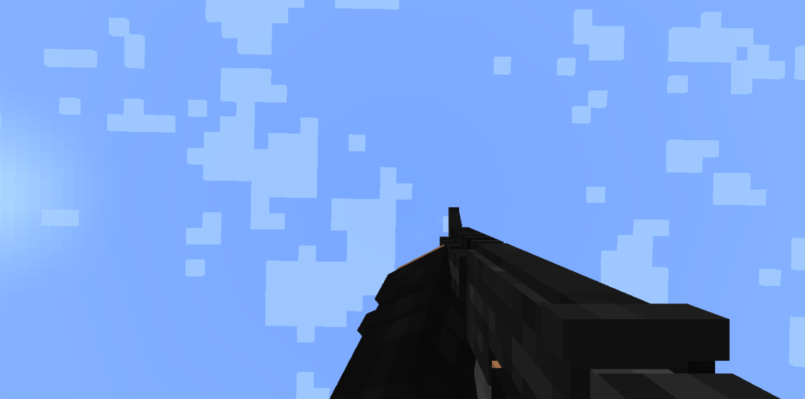

## Aplok's Guns Add-on v1.1 Alpha
Hello everyone, it's me again Gabriel Aplok (amazing, right?), I made a very simple 3d guns add-on for minecraft bedrock, I hope you like it a lot, as I've been working on it with great affection.

## What is Aplok's Guns?
This is an addon created by a simple student who once wanted to learn how to create cool add-ons. The idea of ​​this add-on was to make something simple but elegant. With animations inspired by [Activision](https://www.activision.com/) games and that could be craftable in survival.

## Why should you choose this add-on?
- Smooth and elegant animations.
- Good gun sounds.
- Tactical sprint like Call Of Duty Modern Warfare 2019.
- Good balance on guns.
- Nice animations in first person.
- Nice recoil in guns.
- Each gun has its own animations, both in first and third person.
- You can get all items in survival.
- The add-on doesn't have unnecessary things, that makes it even lighter.
- Low-poly guns with beautiful textures.

## Note
Before starting the review, I must say that all weapons have running and aiming animations, and the running animation works on such a principle that after some time, the usual running animation changes to tactical running animation, like in call of duty: modern warfare.

Don't expect anything innovative or too perfect, I'm just a teenager with nothing to do trying to make something cool for Minecraft.

## Showcases

M4A1


M4A1

## Warning
**<font color="red">Attention, I do not allow anyone to upload this add-on to other sites. I post this addon only on the mcpedl site.</font>**

## Changelog:
```
- First Release.
```

## Downloads:
[Download Support Me <3](https://link-center.net/173623/aplok-guns-3d-add-on)

## Supported Minecraft versions:
1.19.10+
